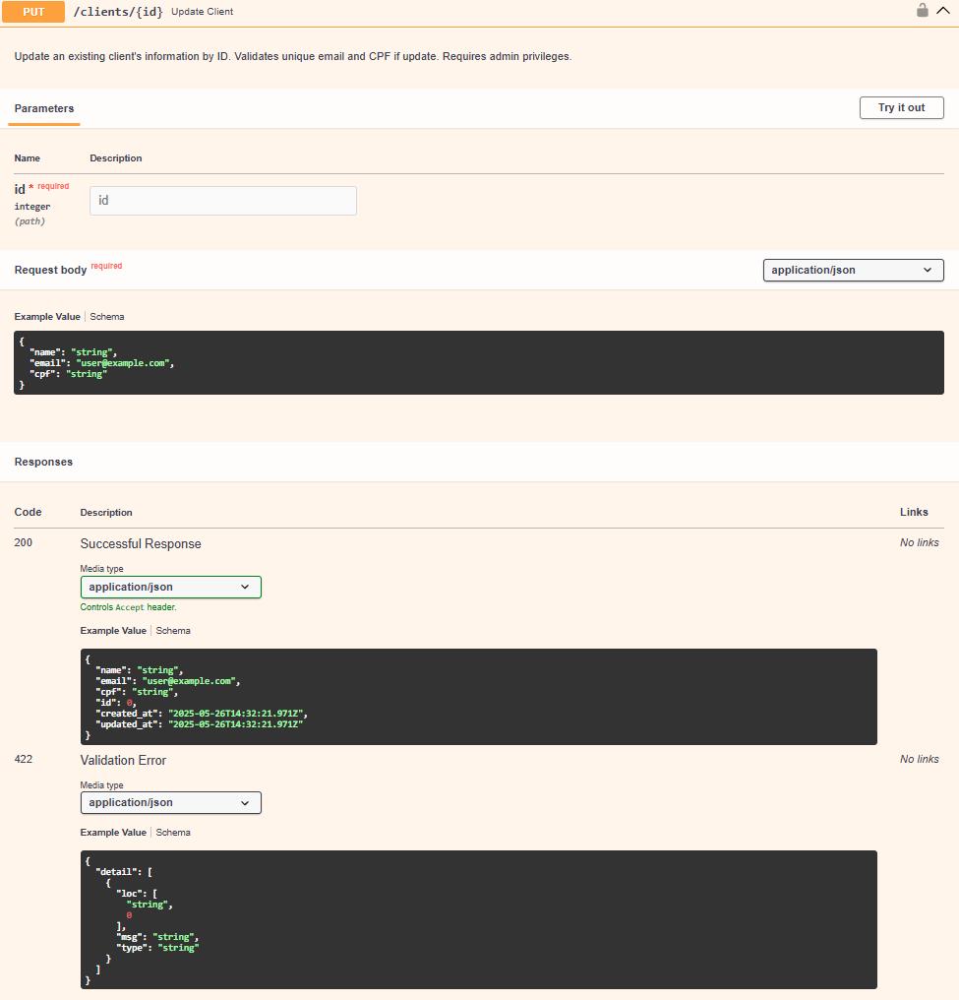

# Teste de Codificação de Desenvolvedor Back-End

**Descrição do Problema**

A Lu Estilo é uma empresa de confecção que está buscando novas
oportunidades de negócio, mas o time comercial não possui nenhuma
ferramenta que facilite novos canais de vendas.

**Solução**

Para ajudar o time comercial, você deve desenvolver uma API RESTful
utilizando FastAPI que forneça dados e funcionalidades para facilitar a
comunicação entre o time comercial, os clientes e a empresa. Essa API deve ser
consumida por uma interface Front-End, que será desenvolvida por outro time.
            Desafio Extra – Integração com WhatsApp
Dando continuidade à solução para o time comercial da Lu Estilo, agora será
necessário integrar a API com o WhatsApp, permitindo que a equipe envie
mensagens automáticas para clientes a partir de eventos comerciais, como
novos pedidos, envio de orçamentos ou promoções.

Desafio

Implemente uma funcionalidade adicional na API que permita o envio de
mensagens de WhatsApp para clientes utilizando WhatsApp API.

---

## Endpoints:

**Autenticação**

POST /auth/login: Autenticação de usuário.
POST /auth/register: Registro de novo usuário.
POST /auth/refresh-token: Refresh de token JWT.


**Clientes**

GET /clients: Listar todos os clientes, com suporte a
paginação e filtro por nome e email.

POST /clients: Criar um novo cliente, validando email e CPF
únicos.

GET /clients/{id}: Obter informações de um cliente
específico.

PUT /clients/{id}: Atualizar informações de um cliente
específico.

DELETE /clients/{id}: Excluir um cliente





**Produtos**

GET /products: Listar todos os produtos, com suporte a
paginação e filtros por categoria, preço e disponibilidade

POST /products: Criar um novo produto, contendo os
seguintes atributos: descrição, valor de venda, código de
barras, seção, estoque inicial, e data de validade (quando
aplicável) e imagens.

GET /products/{id}: Obter informações de um produto
específico.

PUT /products/{id}: Atualizar informações de um produto
específico.

DELETE /products/{id}: Excluir um produto.


**Pedidos**

GET /orders: Listar todos os pedidos, incluindo os seguintes
filtros: período, seção dos produtos, id_pedido, status do
pedido e cliente.

POST /orders: Criar um novo pedido contendo múltiplos
produtos, validando estoque disponível.

GET /orders/{id}: Obter informações de um pedido
específico.

PUT /orders/{id}: Atualizar informações de um pedido
específico, incluindo status do pedido.

DELETE /orders/{id}: Excluir um pedido.


**Usuarios**

GET /users : Lista os usuarios

GET /users/{users_id} : Obter informações de um usuario

PUT /users/{user_id} : Atualizar informações de um usuario

DEL /users/{user_id} : Exclui um usuario


**Schemas**


---

## ⚙️ Como Executar

### Passos

1. Clone o repositório:

```bash
git clone https://github.com/codennomad/LuEstilo-API.git
cd LuEstilo-API
```

2. Inicie os containers:

```bash
docker-compose up --build
```

3. Acesse a documentação interativa da API:

 - Swagger UI: http://localhost:8000/docs

 

 - Redoc: http://localhost:8000/redoc

 

### Deploy

> Atenção: Atualmente, as versões hospedadas estão passando por instabilidades e podem não funcionar corretamente. Recomenda-se rodar o projeto localmente para uma experiência completa da API.

Render: https://luestilo-api.onrender.com/docs

Railway: https://luestilo-api-production.up.railway.app/docs

---

## 🙋‍♂️ Author

Gabriel Henrique 

🔗 [LinkedIn](https://www.linkedin.com/in/gabrielhenrique-tech/)

📧 gabrielheh03@gmail.com

🧑‍💻 Backend Developer | Python | FastAPI | APIs RESTful


